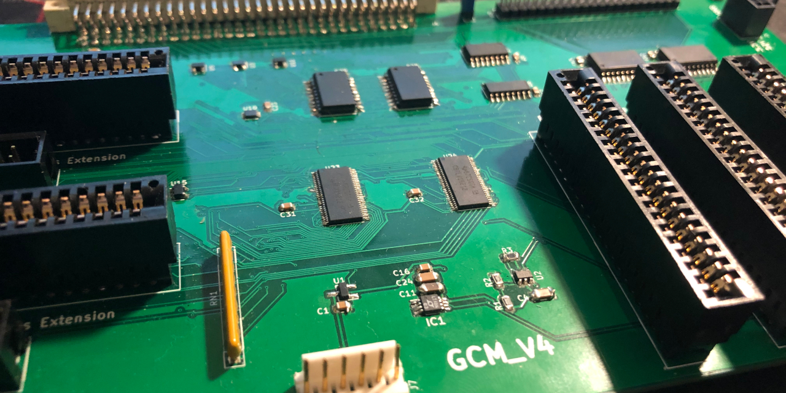
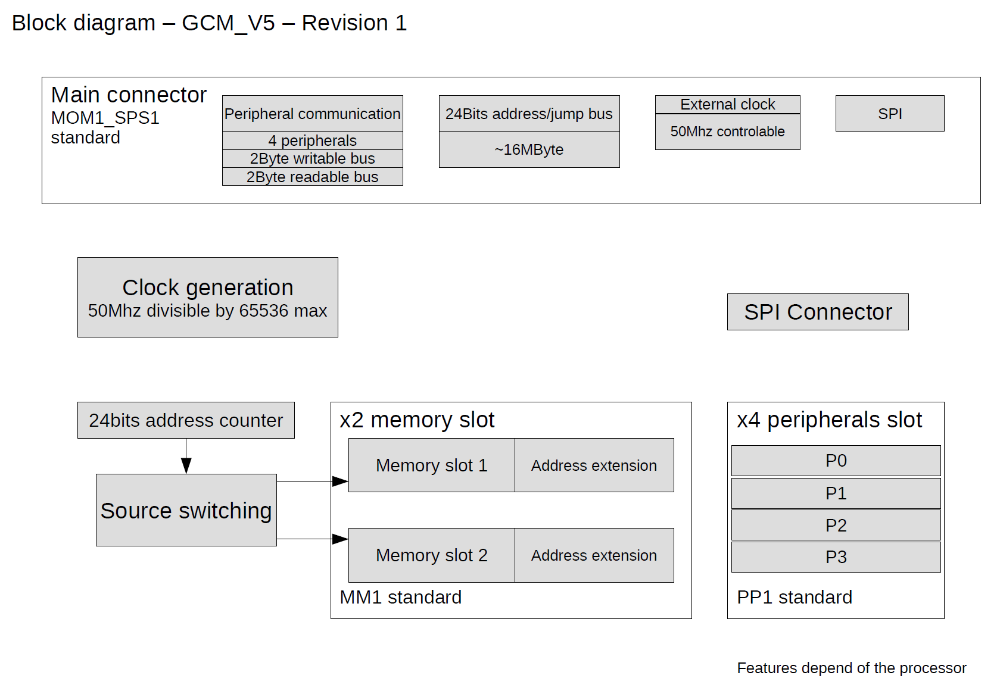

# GCM - GCardMother
Licensed under CERN OHL v.1.2\
Copyright (C) 2020 Guillaume Guillet

## Description
G_CardMother is a homemade without any microcontroller motherboard for 8bits processor like "GP8B"

## Versions list

Actual version :
> GCM_V4

## Block diagram

[Block diagram file](document/Block%20diagram.pdf)

## Main features

- LTC6903 chip for frequency control (1kHz to 68Mhz)

- 2 memory slot with address extension connector

- Source switch between the 2 memory slot

- 4 peripherals slot

- Write bus redirection

## Motherboard standard
This motherboard, follow the [MOM1_SPS1](https://github.com/JonathSpirit/GComputer_standard) standard

## Compatibility
Compatible with all processor following the [SPS1](https://github.com/JonathSpirit/GComputer_standard) standard

| Processor     | Compatibility |
| ------------- | ------------- |
| [GP8B_V4](https://github.com/JonathSpirit/GP8B)  |   |

 `Fully compatible`\
 `Semi compatible`\
 `No compatible`

## Documents
[Block diagram file](document/Block%20diagram.pdf)

*WIP*
