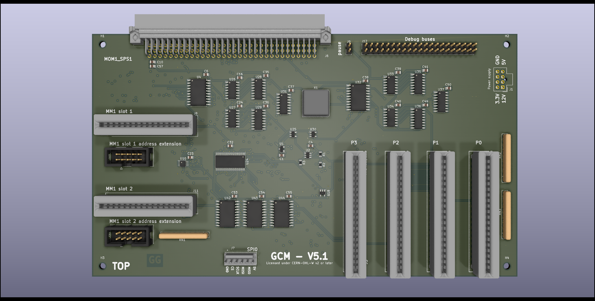

# GCM - GCardMother

Copyright (C) 2021 Guillaume Guillet\
Licensed under CERN-OHL-W v2 or later

<table border="0px">
<tr>
<td>
This source describes Open Hardware and is licensed under the CERN-OHL-W v2 or later.
</td>
</tr>
<tr>
<td>
You may redistribute and modify this documentation and make products
using it under the terms of the CERN-OHL-W v2 (https:/cern.ch/cern-ohl).
This documentation is distributed WITHOUT ANY EXPRESS OR IMPLIED
WARRANTY, INCLUDING OF MERCHANTABILITY, SATISFACTORY QUALITY
AND FITNESS FOR A PARTICULAR PURPOSE. Please see the CERN-OHL-W v2
for applicable conditions.
</td>
</tr>
</table>

Made with [Kicad](https://kicad-pcb.org/)

## Description
G_CardMother is a homemade without any microcontroller motherboard for 8bits processor compatible with the [MOM1_SPS1 standard](https://github.com/JonathSpirit/GComputer_standard) like [GP8B](https://github.com/JonathSpirit/GP8B)

 
 

## Status

Version :
> GCM_V5.1

Status :
> Not tested !

Known issues :
> (unknown)

## Block diagram

[Block diagram (.pdf)](documents/blockDiagram/GCM_blockDiagram.pdf)

## Main features

- Follow the [MOM1_SPS1](https://github.com/JonathSpirit/GComputer_standard) standard.

- A controllable frequency of 50Mhz divisible by multiples of two up to a division of 65536.

- The same separate controllable frequency divisible by multiples of two for peripherals.

- 4 peripherals slot (that follow standard [PP1](https://github.com/JonathSpirit/GComputer_standard)).

- 2 [MM1](https://github.com/JonathSpirit/GComputer_standard) memory slot with address extension.

- Readable code source switching from the 2 memory slot.

- Redirection of the writing buses.

- Accessible debug pins.

## Motherboard standard
This motherboard, follow the [MOM1_SPS1](https://github.com/JonathSpirit/GComputer_standard) standard

## Compatibility
Should be compatible with all processor following the [SPS1](https://github.com/JonathSpirit/GComputer_standard) standard

| Processor     | Compatibility |
| ------------- | ------------- |
| [GP8B_V4.x](https://github.com/JonathSpirit/GP8B/tree/V4.0)  |   |
| [GP8B_V5.0](https://github.com/JonathSpirit/GP8B/tree/V5.0)  |   |
| [GP8B_V5.1+](https://github.com/JonathSpirit/GP8B/tree/V5.1)  |   |

## Documents
[Block diagram (.pdf)](documents/blockDiagram/GCM_blockDiagram.pdf)

[Schematics (.pdf)](documents/GCM_schematics.pdf)

[Materials (.pdf)](documents/GCM_materials.pdf)

[Datasheet (.pdf)](documents/GCM_datasheet.pdf)

## Contributing / Questions
Please see [Contributing file](CONTRIBUTING.md)
